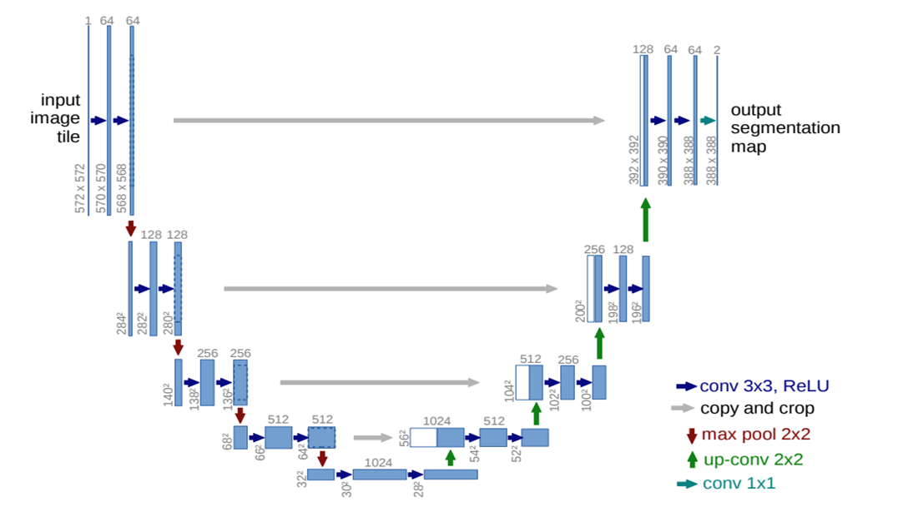
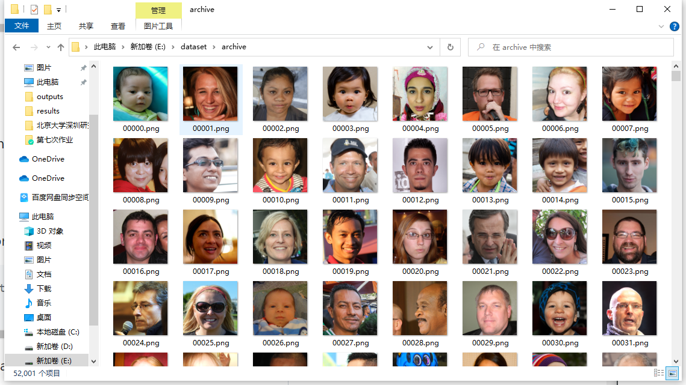
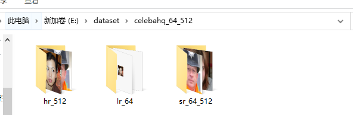
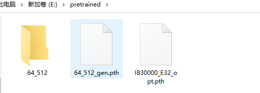
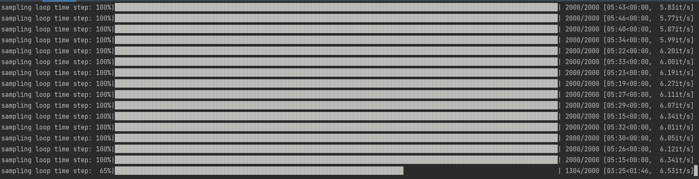
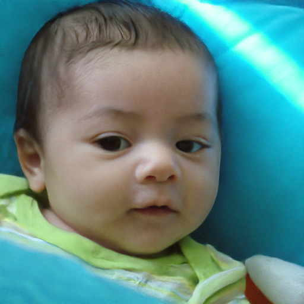
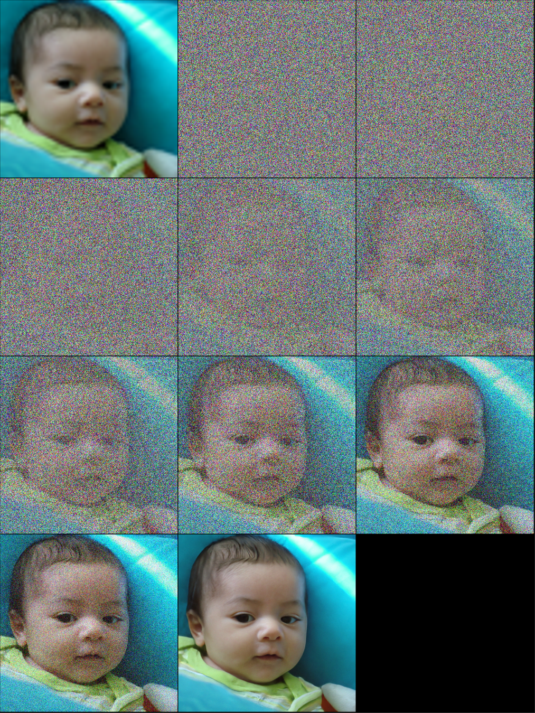
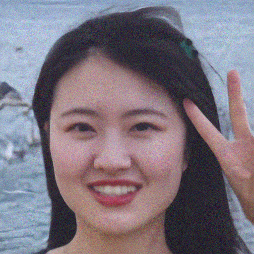
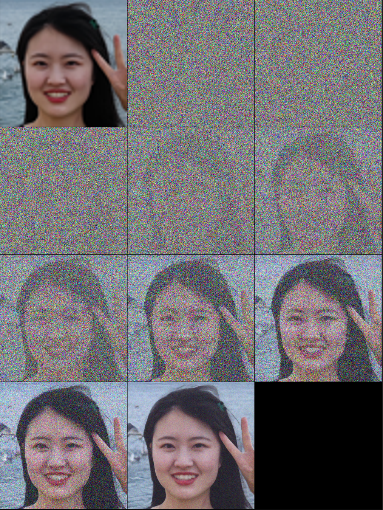

# 计算机视觉第七次作业 - 图像超分辨率

<center>姓名：岳东旭	&emsp;&emsp;&emsp;&emsp;	学号：2201212864	&emsp;&emsp;&emsp;&emsp;	指导老师：张健</center>

[toc]

-----

## 1.问题描述

Github或者主页下载运行一个超分算法，获得结果试着训练一两个Epoch，给出超分结果

## 2.扩散模型算法


扩散模型包含前向扩散，与反向扩散过程。在训练阶段，原始输入图片经过前向扩散不断加入高斯噪声，逐渐变得模糊，无法辨认。接着进行逆扩散过程，将图片逐渐恢复到原来的细节。

在用于图像超分任务时，将低分辨率的图片经过双线性插值，从大小为64变到512，然后在此基础上前向扩散叠加噪声，之后经过及扩散得到结果。

## 3.超分网络架构

选取最新的Diffusion算法实现的网络，据称Diffusion已经在多种任务中全面超越了GAN。

本项目是论文[Image Super-Resolution via Iterative Refinement](https://arxiv.org/abs/2104.07636)的实现，[代码](https://github.com/Janspiry/Image-Super-Resolution-via-Iterative-Refinement)使用Pytorch实现。

### 网络主干

主干架构采用U-NET，该模块在逆扩散过程中负责产生噪声的分布，经过采样即可得到本时刻每像素的采样值。



### 采样算法

采样算法采用DDPM，即按照正向扩散的过程，逆向扩散时采用逐步采样的策略。

## 4.代码模块分析

**文件**主要分为以下几个部分：

- 数据集
  - [FFHQ](https://www.kaggle.com/arnaud58/flickrfaceshq-dataset-ffhq)数据集，包含约5.2k大小为（512，512）的图片



- 模型
  - `model`: 保存U-net模型及DDPM采样算法

## 5.环境搭建及实验

### **实验环境**：

- 操作系统：Win10
- 语言：Python 3.9
- 深度学习框架: PyTorch 1.11

### 安装所需依赖库

- torch>=1.6
- torchvision
- numpy
- pandas
- tqdm
- lmdb
- opencv-python
- pillow
- tensorboardx
- wandb

### 数据预处理

在命令行运行如下命令进行数据预处理，

```
# Resize to get 16×16 LR_IMGS and 128×128 HR_IMGS, then prepare 128×128 Fake SR_IMGS by bicubic interpolation
python data/prepare_data.py  --path [dataset root]  --out [output root] --size 64,512
```

处理后可以得到三个文件夹



分别是：

- 原始512分辨率图片
- 降采样到64分辨率的图片
- 64分辨率图片经过插值得到的512分辨率的模糊图片

### 模型训练

由于采用DDPM算法的扩散模型在训练时会消耗巨量的显存和算力，考虑到本人的经济实力以及计算消耗电力产生的碳排放对环境的影响，本次作业采用预训练模型。



### 模型推理

**使用官方数据集进行测试**：




Sample1：

- 原始图像


- 降采样+插值后的图像


- 扩散模型推理图像



- **扩散过程**



**使用自己采集的数据进行测试(是我可爱的女朋友啦)：**






## 6.总结与思考

本作业选取了Diffusion Model，即扩散模型的方法完成图像超分，从结果可以看出扩散模型的强大魅力，此外，扩散模型还可以用于图像生成等任务，后续我将在个人Github主页推出扩散模型的公式推导和实用分享。