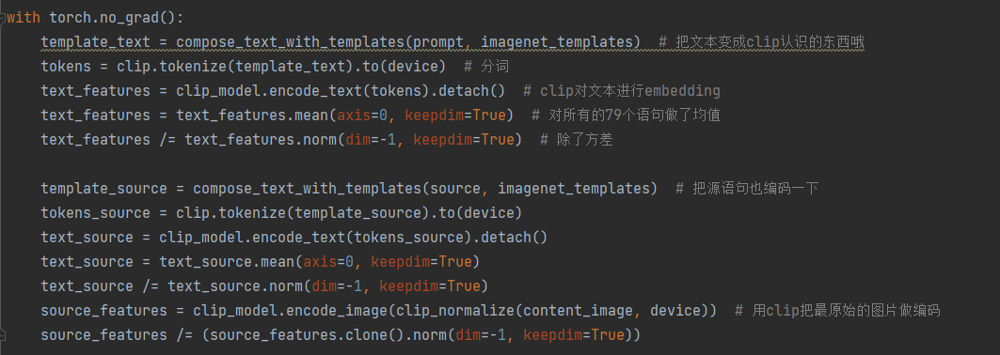
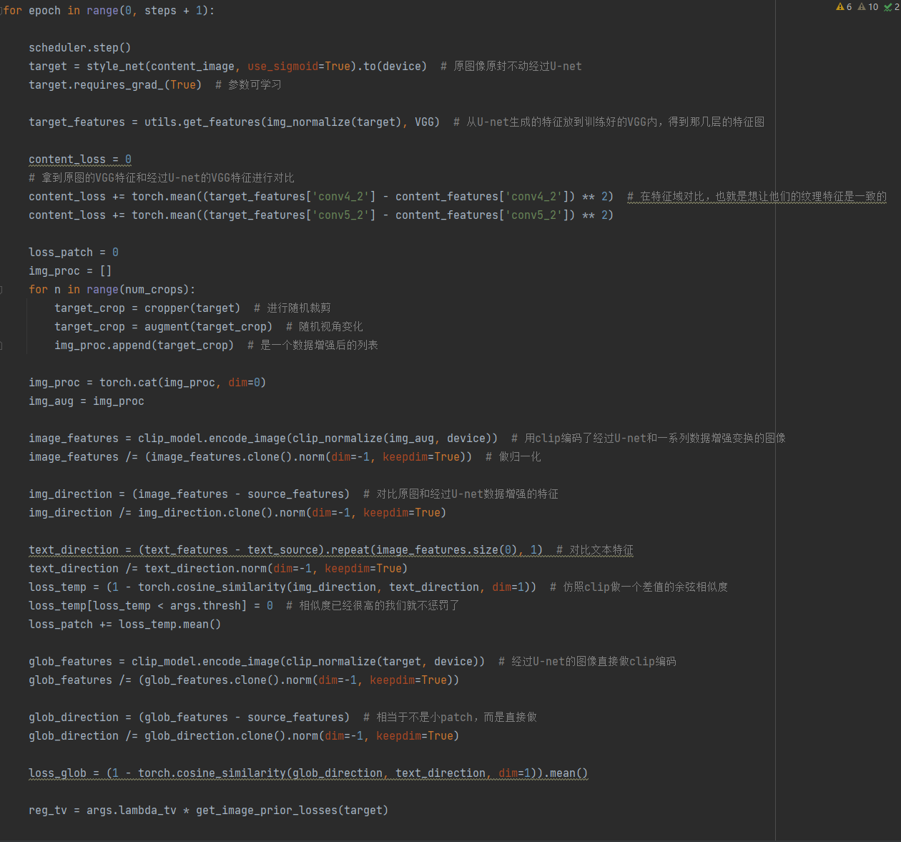
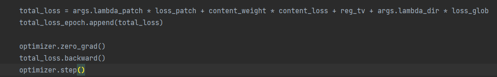
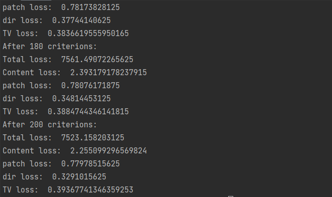
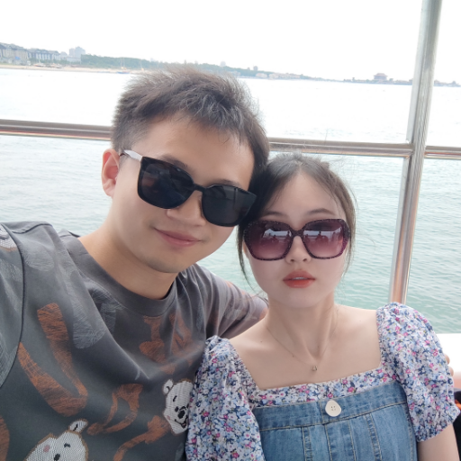
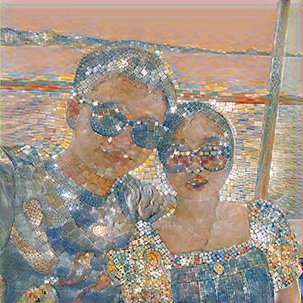
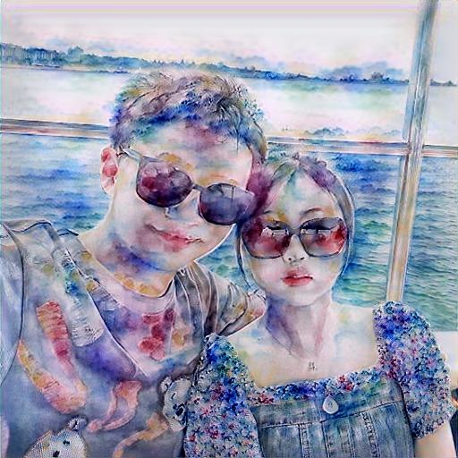

# 计算机视觉第九次作业 - 风格迁移

<center>姓名：岳东旭	&emsp;&emsp;&emsp;&emsp;	学号：2201212864	&emsp;&emsp;&emsp;&emsp;	指导老师：张健</center>

-----

[TOC]

## 1.问题描述

- 寻找一篇 2021/2022年风格迁移的文章
- 翻译其摘要和贡献;对代码主体部分进行注释截图
- 配置环境测试自己的图片进行风格迁移的结果截图

## 2.论文阅读-CLIPstyler: Image Style Transfer with a Single Text Condition

### 2.1摘要

目前的神经架构风格迁移方法都需要参考风格图片，从而将风格图片的纹理信息迁移到内容图片上。然而，在很多实际的场景中，我们可能没有可供参考的风格图片，但是仍然想通过想象来做风格迁移。为了解决这样的应用场景，我们提出了一个新的网络架构，不需要风格图片，仅仅需要目标风格的文本描述就可以完成风格迁移任务。使用预训练CLIP的文本图像编码模型，我们揭示了内容图像的风格的表征只需要一个文本条件。具体而言，我们提出了一种小块式文本-图像匹配损失与多视图增量逼真的纹理转移。扩展实验的结果证实了使用能够反映语义查询文本的逼真的纹理可以成功地进行图像风格迁移。

### 2.2主要贡献

以往的方法主要是将文本条件的语义信息传递到视觉域，然而存在的问题是由于嵌入模型的性能，语义信息不能被正确的表征，而且对图像风格的迁移只能局限在特定的内容域，比如只能针对人脸图像进行风格迁移，因为这些方法极大地依赖于预训练的生成模型。

针对以上问题，本文的主要贡献如下：

1. 使用最新的CLIP模型做文本嵌入编码。
2. 本文提出训练一个轻量化的CNN网络来表达纹理信息，产生丰富的结果。
3. 提出了一种小块式文本-图像匹配损失与多视图增量逼真的纹理转移。

## 3.代码主体

**先创建不需要计算梯度的特征**



**计算文章中提到的损失函数**



**将所有损失函数汇总,更新优化U-net**



## 4.环境搭建及实验

### 环境配置

在基础的深度学习框架下,还需要另外安装CLIP的api

```
pip install clip-anytorch
```

### 模型训练

本文的模型具有两种训练方式:

1. 输入单张图片训练,可以指定图片的风格,输出结果是单张风格迁移后的图片.
2. 输入是整批次的图片用于训练,可以对各种不同类型的图片进行风格迁移,具有很好的泛化能力,用于测试的同样是整批次的图片.

运行命令:

```
python .\train_CLIPstyler.py --content_path .\test_set\yam.png --content_name 'face' --exp_name 'exp3' --text 'Sketch with black pencil'
```



共迭代200轮,得到结果:

**原图**



**风格迁移:text(Sketch with black pencil)**


**text(Mosaic)**



**text(Watercolor painting)**

