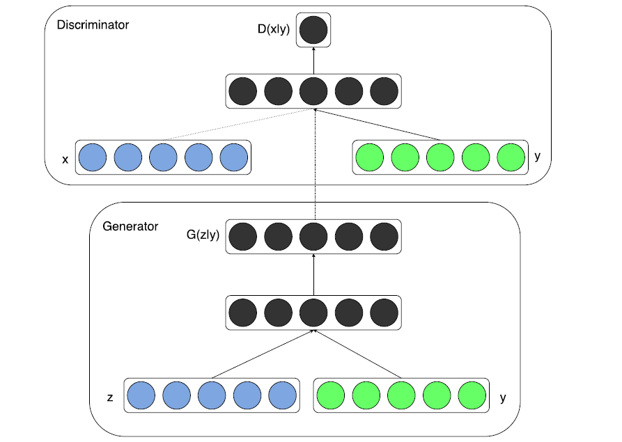

# 计算机视觉第八次作业 - GAN

姓名：岳东旭	&emsp;&emsp;&emsp;&emsp;	学号：2201212864	&emsp;&emsp;&emsp;&emsp;	指导老师：张健

-----

## 1.问题描述

- https :://github com/eriklindernoren/PyTorch GAN 上任选一个感兴趣的 GAN 的程序 下载运行成功。

- 阅读该程序的论文 写出阅读总结 并对应代码标注出论文中的公式以及网络所对应的代码阐述清楚。

## 2.论文阅读-CGAN

### Motivation

一般的生成对抗网络是利用生成器和判别器两个模块，不断对抗博弈，最终让生成器达到较好的生成性能，但是生成的内容不是可控的，本文试图在GAN网络上加入额外的信息，来使生成器生成我们想要的结果。

例如在Mnist数据集上，可以指定生成器生成特定的数字图片。

### Intuition

一种比较直接的实现方法是，在生成器和判别器上分别加入condition信息，与原有的tensor融合，来达到条件生成的目的。

### Framework

#### 生成器

#### 判别器

仅仅是在原GAN的架构上加入了一层embedding，用于把条件信息加入进来

#### 损失函数

然而在pytorch实现中，作者可能是自作聪明，把损失函数换成了MSEloss，而且没有在判别器部分加sigmoid，把输出映射到0与1之间。

## 3.环境搭建及实验

### 模型训练

共训练200个epoch：

### 效果评价

- 