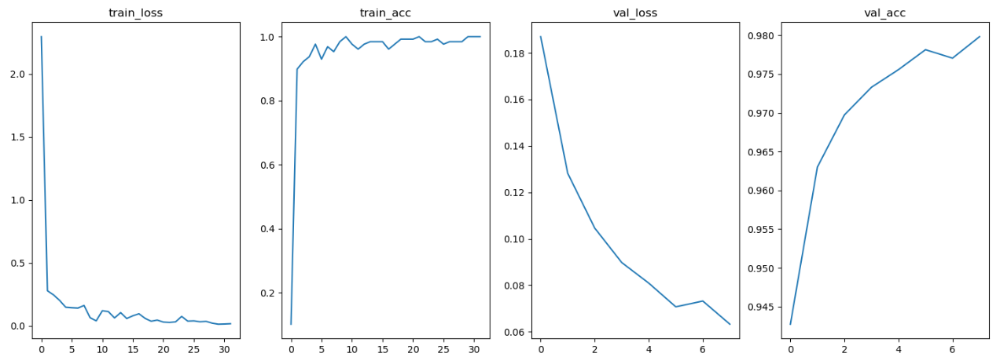
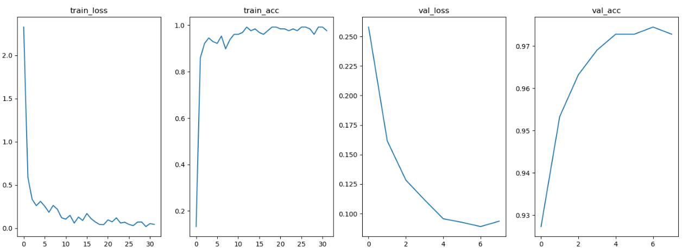
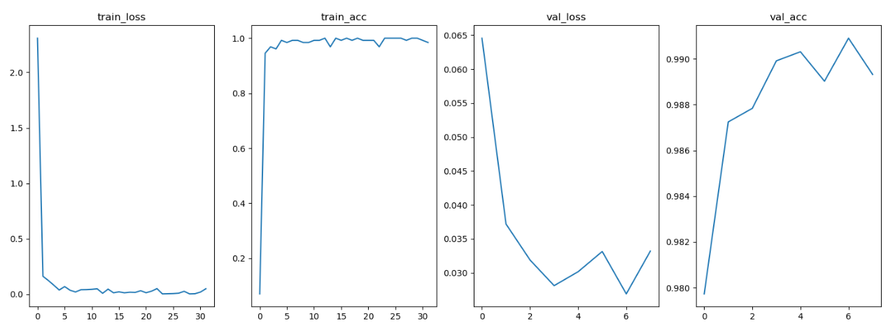
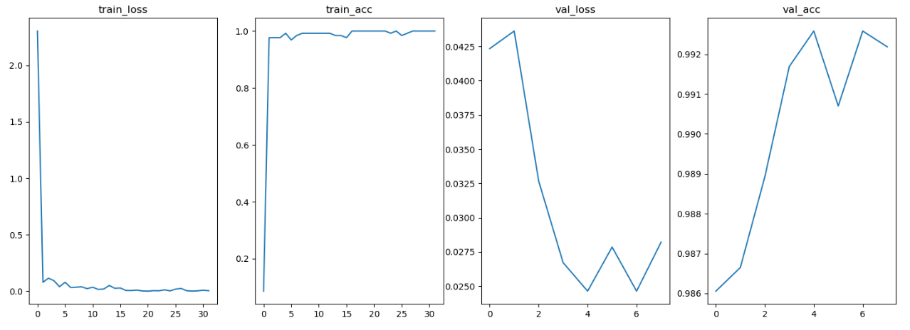
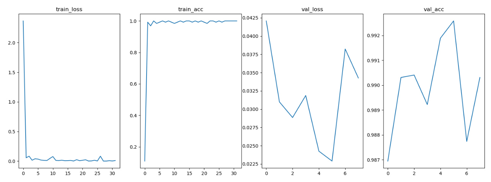
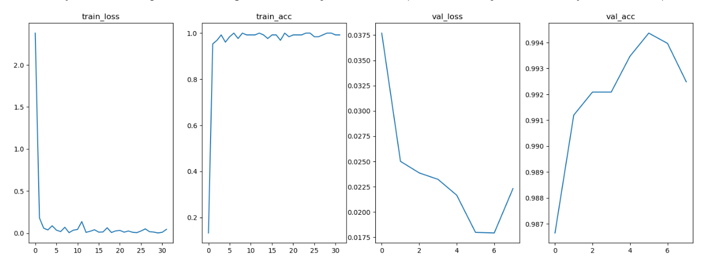

# 计算机视觉第六次作业

<div align = "center"> 岳东旭        2201212864       指导教师：张健</div>

code:https://github.com/NICHOLASFATHER/dongxu_master_degree/blob/master/W6_MNIST_FC.ipynb

## 1.问题描述

在W6_MNIST_FC.ipynb基础上，增加卷积层结构/增加 dropout或者BN技术等，训练出尽可能高的MNIST分类效果。

## 2.超参数设置与数据集构建

```python

torch.manual_seed(1)

EPOCH = 8
LR = 0.001
batch_size = 128
DOWNLOAD_MNIST = True
Device = 'cuda' if torch.cuda.is_available() else 'cpu'

train_data = torchvision.datasets.MNIST(root='./mnist/', train=True, transform=torchvision.transforms.ToTensor(),
                                        download=DOWNLOAD_MNIST)
test_data = torchvision.datasets.MNIST(root='./mnist/', train=False, transform=torchvision.transforms.ToTensor(),
                                        download=DOWNLOAD_MNIST)

train_dataloader = DataLoader(train_data, batch_size=batch_size, shuffle=True, pin_memory=True)
test_dataloader = DataLoader(test_data, batch_size=batch_size, shuffle=False, pin_memory=True)
```


## 3.模型搭建

```python
# baseline
class FC_1(nn.Module):
    def __init__(self):
        super(FC_1, self).__init__()
        self.fc1 = nn.Linear(784, 256)
        self.fc2 = nn.Linear(256, 10)
#         self.fc3 = nn.Linear(10, 10)

    def forward(self, x):
        x = x.view(x.size(0), -1)  # 调整数据维度
        x = self.fc1(x)  
        x = F.relu(x)
        x = self.fc2(x)
#         x = F.relu(x)
#         x = self.fc3(x)

        output = x
        return output
        
# baseline plus
class FC_2(nn.Module):
    def __init__(self):
        super(FC_2, self).__init__()
        self.fc1 = nn.Linear(784, 256)
        self.fc2 = nn.Linear(256, 10)
        self.fc3 = nn.Linear(10, 10)

    def forward(self, x):
        x = x.view(x.size(0), -1)  # 调整数据维度
        x = self.fc1(x)  
        x = F.relu(x)
        x = self.fc2(x)
        x = F.relu(x)
        x = self.fc3(x)

        output = x
        return output
        

class Conv_net_base(nn.Module):
    def __init__(self):
        super(Conv_net_base, self).__init__()
        self.net = nn.Sequential(
            nn.Conv2d(1, 32, 5, padding=2),  # h,w保持不变
            nn.MaxPool2d(2),
            nn.ReLU(),
            nn.Conv2d(32, 64, 5, padding=2),
            nn.MaxPool2d(2),
            nn.ReLU(),
            nn.Flatten(),
            nn.Linear(64*7*7, 10)
        )

    def forward(self, x):
        x = self.net(x)
        return x
        

class Conv_net_plus(nn.Module):
    def __init__(self):
        super(Conv_net_plus, self).__init__()
        self.net = nn.Sequential(
            nn.Conv2d(1, 16, 5, padding=2),  # h,w保持不变
            nn.MaxPool2d(2),
            nn.ReLU(),
            nn.Conv2d(16, 32, 5, padding=2),  # h,w保持不变
            nn.MaxPool2d(2),
            nn.ReLU(),
            nn.Conv2d(32, 64, 5, padding=2),
            nn.Flatten(),
            nn.ReLU(),
            nn.Linear(64*7*7, 512),
            nn.ReLU(),
            nn.Linear(512, 10)
        )

    def forward(self, x):
        x = self.net(x)
        return x
        

class Conv_net_plus_bn(nn.Module):
    def __init__(self):
        super(Conv_net_plus_bn, self).__init__()
        self.net = nn.Sequential(
            nn.Conv2d(1, 16, 5, padding=2),  # h,w保持不变
            nn.BatchNorm2d(16),
            nn.MaxPool2d(2),
            nn.ReLU(),
            
            nn.Conv2d(16, 32, 5, padding=2),  # h,w保持不变
            nn.BatchNorm2d(32),
            nn.MaxPool2d(2),
            nn.ReLU(),

            nn.Conv2d(32, 64, 5, padding=2),
            nn.BatchNorm2d(64),
            nn.ReLU(),

            nn.Flatten(),
            nn.Linear(64*7*7, 512),
            nn.BatchNorm1d(512),
            nn.ReLU(),
            nn.Linear(512, 10)
        )

    def forward(self, x):
        x = self.net(x)
        return x
        
        

class Conv_net_plus_bn_dropout(nn.Module):
    def __init__(self):
        super(Conv_net_plus_bn_dropout, self).__init__()
        self.net = nn.Sequential(
            nn.Conv2d(1, 16, 5, padding=2),  # h,w保持不变
            nn.BatchNorm2d(16),
            nn.MaxPool2d(2),
            torch.nn.Dropout2d(p=0.1),
            nn.ReLU(),

            nn.Conv2d(16, 32, 5, padding=2),  # h,w保持不变
            nn.BatchNorm2d(32),
            nn.MaxPool2d(2),
            torch.nn.Dropout2d(p=0.1),
            nn.ReLU(),

            nn.Conv2d(32, 64, 5, padding=2),
            nn.BatchNorm2d(64),
            torch.nn.Dropout2d(p=0.1),
            nn.ReLU(),

            nn.Flatten(),
            nn.Linear(64*7*7, 512),
            nn.BatchNorm1d(512),
            torch.nn.Dropout(0.2),
            nn.ReLU(),
            nn.Linear(512, 10)
        )

    def forward(self, x):
        x = self.net(x)
        return x
```

## 4.训练与可视化

```python
def train(network, save_name):

    optimizer = torch.optim.Adam(network.parameters(), lr=LR)
    # loss_func = nn.MSELoss()
    loss_func = nn.CrossEntropyLoss()
    best_val_acc = 0
    train_loss = []
    train_acc = []
    val_loss = []
    val_acc = []

    for epoch in range(EPOCH):
        loss_sum = 0
        acc_sum = 0
        print(f'EPOCH{epoch}\n-----------------')
        size = len(train_dataloader.dataset)

        network.train()
        for batch, item in enumerate(train_dataloader):

            # if batch == 4:  # 删除
            #     break

            pics, labels = item
            pics = pics.to(Device)
            labels = labels.to(Device)
            
            output = network(pics)
            loss = loss_func(output, labels)
            loss.backward()
            optimizer.step()
            optimizer.zero_grad()
            if batch % 150 == 0:
                loss_value, current = loss.item(), batch*len(pics)
                train_loss.append(loss_value)
                acc = (output.argmax(dim=1) == labels).sum().item() / len(pics)
                train_acc.append(acc)
                print(f'loss:{loss_value:>7f}  accuracy:{acc:>7f}  [{current:>5d}/{size:>5d}]')


        with torch.no_grad():
            network.eval()
            for item in test_dataloader:
                pics, labels = item
                pics = pics.to(Device)
                labels = labels.to(Device)
                output = network(pics)  # (bs, 10)
                loss = loss_func(output, labels)
                loss_sum += loss.item()
                acc = (output.argmax(dim=1) == labels).sum().item() / len(pics)
                acc_sum += acc
            current_val_acc = acc_sum/len(test_dataloader)
            val_loss.append(loss_sum/len(test_dataloader))
            val_acc.append(current_val_acc)
            if current_val_acc > best_val_acc:
                best_val_acc = current_val_acc
                torch.save(network.state_dict(), f'{save_name}_model.pth')
            print(f'Test\nloss:{loss_sum/len(test_dataloader):>7f}  accuracy:{current_val_acc:>5f}')

    names = ['train_loss', 'train_acc', 'val_loss', 'val_acc']
    plt.figure(figsize=(18, 6))
    plt.subplot(141)
    plt.plot(train_loss)
    plt.title(names[0])
    plt.subplot(142)
    plt.plot(train_acc)
    plt.title(names[1])
    plt.subplot(143)
    plt.plot(val_loss)
    plt.title(names[2])
    plt.subplot(144)
    plt.plot(val_acc)
    plt.title(names[3])
    plt.figure(figsize=(18, 6))
    plt.plot(val_acc)
    plt.title(names[3])
    return best_val_acc
```

### 第一组：



### 第二组：



### 第三组：



### 第四组：



### 第五组：



### 第六组：



## 5.实验结果及分析

|                网络架构                 | 测试准确率 |
| :-------------------------------------: | :--------: |
|        **base_fc（两层全连接）**        | **0.9798** |
|        **plus_fc（三层全连接）**        | **0.9744** |
|        **conv_base（两层CNN）**         | **0.9909** |
|        **conv_plus（三层CNN）**         | **0.9925** |
|   **conv_plus_bn（增加bacth_norm）**    | **0.9925** |
| **conv_plus_bn_dropout（增加dropout）** | **0.9943** |

可见，通过加深网络层数、加入batch_norm技术和dropout正则化，可以有效地提高准确率。


## 6.思考与改进

- 受限于时间和计算资源，本次作业设置epoch为8，而且使用了较大的batch_size（为了节省时间）。这样做可能使得模型没有被充分训练，因此可以从这两个超参入手改进。

- 可以考虑加入动态学习率调节，如余弦衰减，可能会让模型在更短的时间内收敛。

- 根据现有的资料，发现Dropout和batchnorm一起用的时候可能会存在问题，出现1+1<2的效果，论文：[Understanding the Disharmony between Dropout and Batch Normalization by Variance Shift](https://link.zhihu.com/?target=https%3A//arxiv.org/abs/1801.05134)，一种可行的解决方案是把Dropout放在batchnorm之后。

​		
