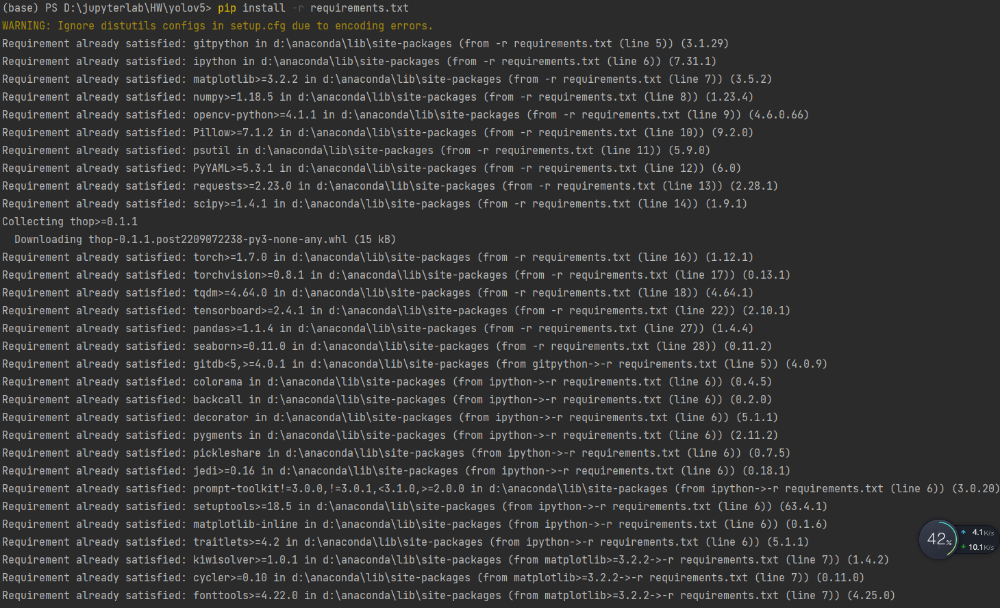
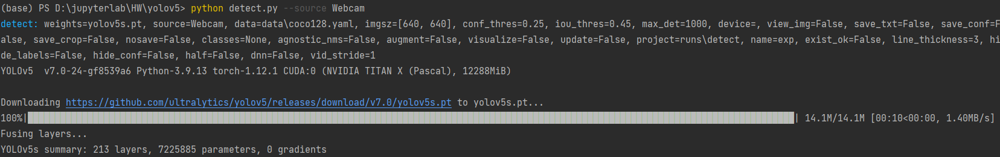
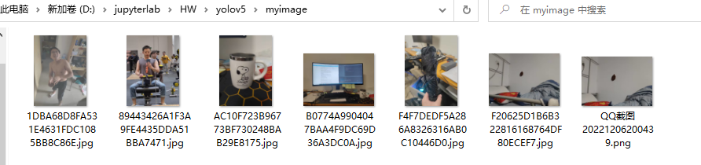
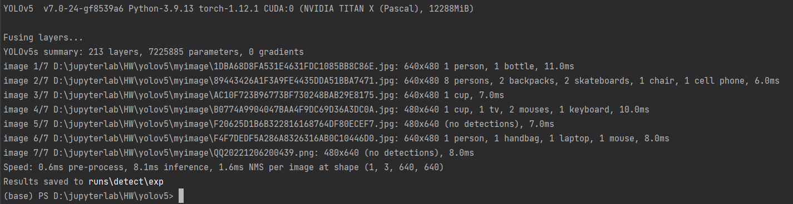
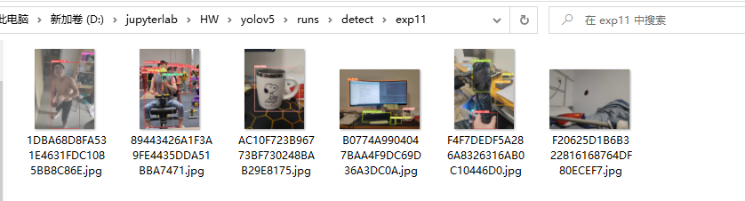
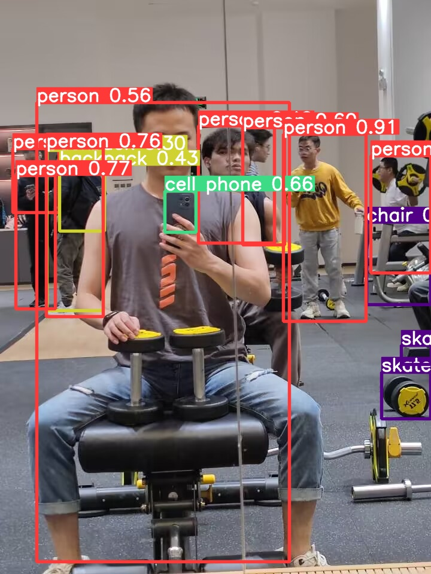
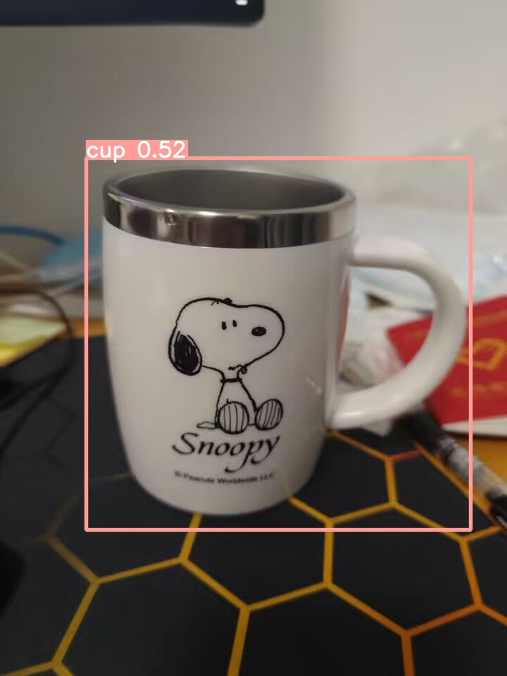
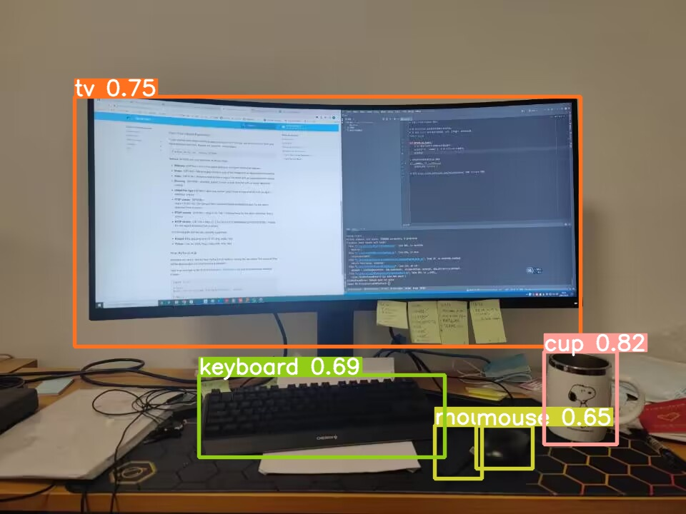
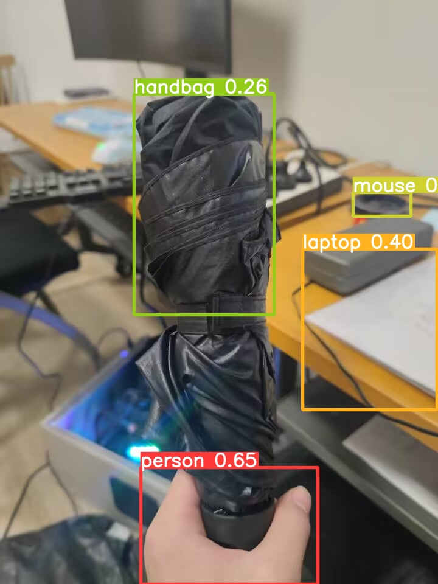

# 计算机视觉第十次作业 - YOLO

<center>姓名：岳东旭	&emsp;&emsp;&emsp;&emsp;	学号：2201212864	&emsp;&emsp;&emsp;&emsp;	指导老师：张健</center>

-----

[TOC]

## 1.问题描述

- 下载运行YOLOv4(YOLOv5).py代码，测试5幅图
- 文档中说明跟之前版本的具体改进和不同

## 2.下载运行截图

### 2.1环境安装

安装所需依赖：



运营测试代码，顺便下载预训练模型：



### 2.2构建自己的测试数据

将待测图片放在一个文件夹内：



### 2.3运行YOLO代码得到测试结果

运行代码：

```
python detect.py --source OPTION=D:/jupyterlab/HW/yolov5/myimage
```






选取四张图：

pic1：健身房随手拍hh



pic2：新买的马克杯



pic3：工位电脑



pic4：我的雨伞，貌似YOLO不太认识雨伞



## 3.与之前版本的比较

1. [yolov4](https://so.csdn.net/so/search?q=yolov4&spm=1001.2101.3001.7020)采用了较多的数据增强方法([图像增强方法(Data Augmentation)_YMilton的专栏-CSDN博客](https://blog.csdn.net/YMilton/article/details/120041404),博客中方法都使用)，而[yolov5](https://so.csdn.net/so/search?q=yolov5&spm=1001.2101.3001.7020)进行了3中数据增强：缩放、色彩空间调整与Mosaic数据增强。

2. yolov5[锚点](https://so.csdn.net/so/search?q=锚点&spm=1001.2101.3001.7020)框是基于训练数据集自动学习的，而yolov4没有自适应锚点框。

3. yolov5采用的[激活函数](https://so.csdn.net/so/search?q=激活函数&spm=1001.2101.3001.7020)包括leakyReLU和Sigmoid，yolov5的中间隐藏层使用的是leakyReLU激活函数，最后的检测层使用的是Sigmoid激活函数。而yolov4使用的是mish与leakyReLU激活函数，主干网络使用的mish。mish激活函数的复杂度较高。

4. yolov5提供了两个优化函数Adam与SGD，并且都预设了与之匹配的训练超参数，默认使用SGD。而yolov4采用SGD优化函数。

5. yolo系列损失计算包括目标置信度、类别概率与边界框回归损失。yolov5中的边界框损失前期采用的是GIoU Loss，后期使用CIoU Loss，yolov4中采用的是CIoU Loss，与其他方法相比，CIoU带来了更快的收敛和更好的性能。

6. 目标检测在前向推理过程都会采用NMS(非极大值抑制)，yolov4在前向推理的过程中使用的方法是DIoU_nms，而yolov5采用加权nms的方式。